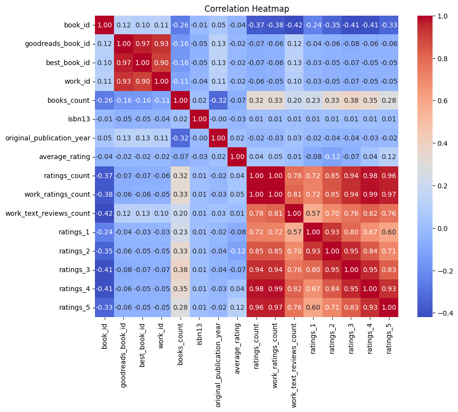

```markdown
# Analysis of the Goodreads Dataset

## 1. General Description of the Dataset
The dataset consists of 10,000 entries, each representing a book with various attributes. The columns include identifiers like `book_id`, `goodreads_book_id`, `best_book_id`, and `work_id`, alongside details about the book such as `authors`, `original_title`, `average_rating`, `ratings_count`, and the publication year. This dataset provides a comprehensive view of book ratings and information, making it valuable for exploring trends in literature.

## 2. Descriptive Statistics of the Dataset
The dataset contains a mix of numerical and categorical data. Key descriptive statistics include:
- **Average Rating**: The average rating of books is approximately 4.00, suggesting that many users rate books positively.
- **Ratings Count**: The average number of ratings per book is quite high, with `ratings_count` averaging around 54,000.
- **Publication Year**: Most books were published after 1980, with 2017 as the latest year recorded.
  
Here are some of the important statistics:
- **Minimum Average Rating**: 2.47
- **Maximum Average Rating**: 4.82
- **Maximum Books Count**: 3,455 (this may indicate popular or widely-read books)

## 3. Missing Values in the Dataset
Missing values can often skew analysis and results. Here is the count of missing values for each column:

- `isbn`: 700 missing values
- `isbn13`: 585 missing values
- `original_publication_year`: 21 missing values
- `original_title`: 585 missing values
- `language_code`: 1084 missing values

Columns such as `language_code` have a significant number of missing entries, which may require imputation or exclusion in further analyses.

## 4. Visualizations

### Correlation Heatmap
A correlation heatmap was generated to visualize the relationships between numerical columns. High correlations can indicate multicollinearity, while low correlations can point to more independent features. 



### Box Plot for Outliers Analysis
A box plot was created to identify potential outliers in the dataset. This is crucial as outliers can disproportionately influence statistical calculations and model performance.


## 5. Potential Next Steps for Analysis
Based on the insights derived from this dataset, several potential next steps can be undertaken:
- **Further Exploration of Missing Values**: Investigating the effects of missing data and deciding on imputing strategies or removal of records.
- **Genre Analysis**: If genre data is available, analyzing how different genres perform in terms of ratings and publications could yield interesting insights.
- **Sentiment Analysis on Reviews**: If work_text_reviews_count is available, a qualitative analysis of user reviews could highlight sentiments around specific works or authors.
- **Trend Analysis Over Time**: Investigating trends in average ratings or other metrics over years or decades can provide insights into changing reader preferences.

This dataset provides a rich landscape for analysis, highlighting the interplay of different aspects of book popularity and reception.
```
 
