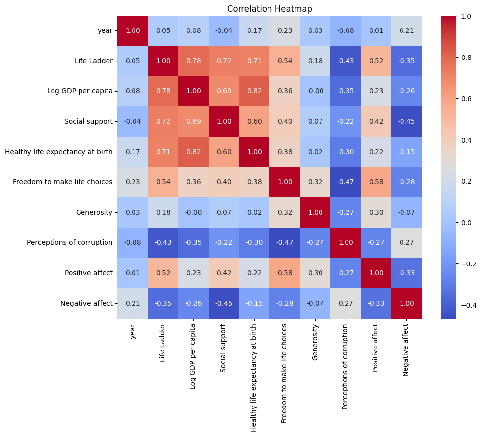

# Analysis of the Happiness Dataset

## 1. General Description of the Dataset
The dataset consists of 2,363 entries and contains 11 columns related to the happiness of various countries over different years. The columns include:

- **Country Name**: The name of the country.
- **Year**: The year of the observation.
- **Life Ladder**: A numeric score representing the perceived quality of life.
- **Log GDP per Capita**: A logarithmic transformation of the Gross Domestic Product per capita.
- **Social Support**: A metric indicating the level of support individuals feel they have in their social circles.
- **Healthy Life Expectancy at Birth**: The average number of years a newborn is expected to live in good health.
- **Freedom to Make Life Choices**: A score indicating the level of freedom individuals feel they have in their choices.
- **Generosity**: A score reflecting people's willingness to give or help others.
- **Perceptions of Corruption**: A score representing individuals' perceptions regarding corruption in their country.
- **Positive Affect**: A measure of the presence of positive emotions.
- **Negative Affect**: A measure of the presence of negative emotions.

## 2. Descriptive Statistics of the Dataset
The dataset contains numeric values with specific statistics:

- **Life Ladder**: Ranges from 1.281 to 8.019, with a mean of approximately 5.48.
- **Log GDP per Capita**: Ranges from 5.527 to 11.676, with a mean of around 9.40.
- **Social Support**: Ranges from 0.228 to 0.987 with a mean score of approximately 0.81.
  
The dataset provides an insight into the correlation between happiness indicators and economic metrics across different countries and years.

## 3. Missing Values in the Dataset
Upon analyzing the dataset, the following missing values were identified:

- **Log GDP per capita**: 28 missing values
- **Social support**: 13 missing values
- **Healthy life expectancy at birth**: 63 missing values
- **Freedom to make life choices**: 36 missing values
- **Generosity**: 81 missing values
- **Perceptions of corruption**: 125 missing values
- **Positive affect**: 24 missing values
- **Negative affect**: 16 missing values

Overall, while the dataset is mostly complete, certain columns have significant missing data that could possibly impact the analysis.

## 4. Visualizations

### Correlation Heatmap
To understand the relationships between the numeric columns in the dataset, we generated a correlation heatmap. The correlation matrix provides insights into how various factors relate to the Life Ladder and each other.

### Box Plot for Outlier Analysis
We also generated a box plot to analyze potential outliers in the numeric columns, which can help us understand individual countries that may significantly differ from the average indicators.

## 5. Potential Next Steps for Analysis
1. **Imputation of Missing Values**: Before delving deeper into analysis, handling missing values through imputation or filtering will improve the reliability of the findings.
  
2. **Time Series Analysis**: Analyze how happiness and its indicators have changed over the years across different countries for trend identification.

3. **Clustering and Classification**: Apply KMeans clustering to identify groups of countries with similar characteristics and happiness levels, followed by exploring the factors contributing to these groupings.

4. **Predictive Analysis**: Develop predictive models to identify which factors most significantly affect happiness and well-being.

5. **Regional Comparisons**: Investigate and compare happiness metrics across different regions to identify patterns based on geography.

Through these steps, we can derive further insights that can help inform policies to improve happiness and overall living standards in various countries. 
