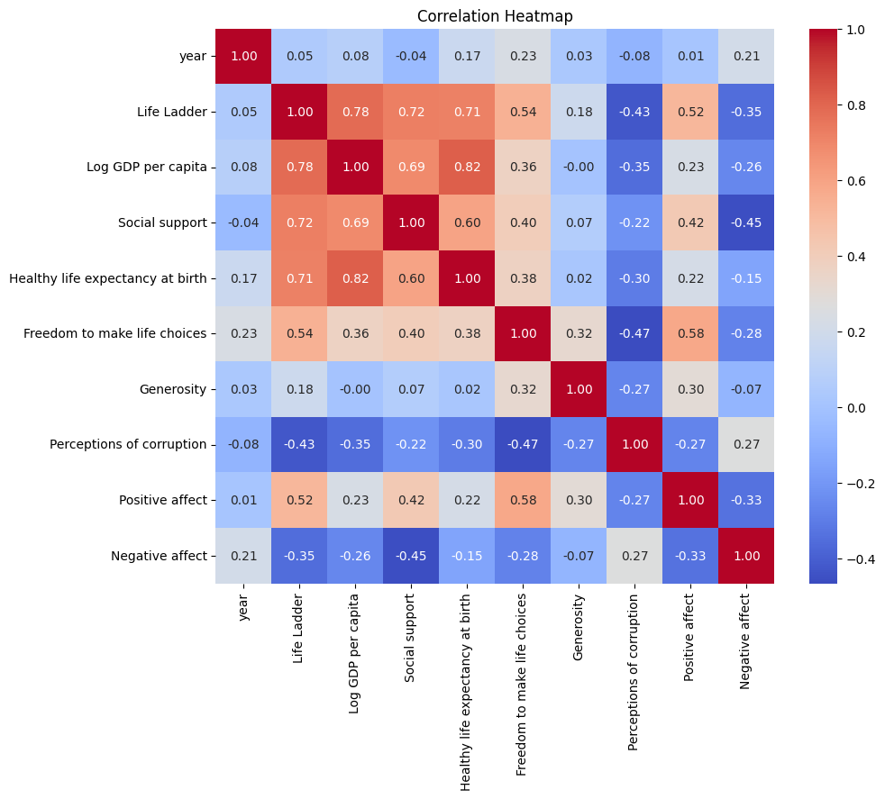
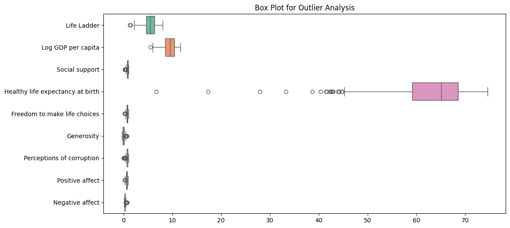

# Data Analysis of Happiness Dataset

## General Description

The dataset titled **happiness** contains information collected from various countries, regarding factors that contribute to the perception of happiness. It consists of **2363 entries** and **11 columns** data points. The columns include:

1. **Country name**: The name of the country.
2. **Year**: The year of data collection.
3. **Life Ladder**: A measure of perceived quality of life.
4. **Log GDP per capita**: The logarithm of GDP per capita as a measure of economic prosperity.
5. **Social support**: Evaluated support the citizens perceive from their society.
6. **Healthy life expectancy at birth**: Forecasted average life expectancy that is healthy at birth.
7. **Freedom to make life choices**: Personal freedom felt by individuals.
8. **Generosity**: The level of charitable giving in the population.
9. **Perceptions of corruption**: How corruption is perceived in each country.
10. **Positive affect**: Positive emotional experiences reported by individuals.
11. **Negative affect**: Negative emotional experiences reported by individuals.

## Descriptive Statistics

The table below outlines the descriptive statistics for the numeric columns in the dataset:

| Statistic | Life Ladder | Log GDP per capita | Social support | Healthy life expectancy | Freedom to make life choices | Generosity | Perceptions of corruption | Positive affect | Negative affect |
|-----------|-------------|---------------------|----------------|------------------------|-------------------------------|------------|--------------------------|----------------|-----------------|
| Count     | 2363        | 2335                | 2350           | 2300                   | 2327                          | 2282       | 2238                     | 2339           | 2347            |
| Mean      | 5.48        | 9.40                | 0.81           | 63.40                  | 0.75                          | 0.00       | 0.74                     | 0.65           | 0.27            |
| Std Dev   | 1.12        | 1.15                | 0.12           | 6.84                   | 0.14                          | 0.16       | 0.18                     | 0.11           | 0.09            |
| Min       | 1.28        | 5.53                | 0.23           | 6.72                   | 0.23                          | -0.34      | 0.04                     | 0.18           | 0.08            |
| 25th %ile | 4.65        | 8.51                | 0.74           | 59.20                  | 0.66                          | -0.11      | 0.69                     | 0.57           | 0.21            |
| Median    | 5.45        | 9.50                | 0.83           | 65.10                  | 0.77                          | -0.02      | 0.80                     | 0.66           | 0.26            |
| 75th %ile | 6.32        | 10.39               | 0.90           | 68.55                  | 0.86                          | 0.09       | 0.87                     | 0.74           | 0.33            |
| Max       | 8.02        | 11.68               | 0.99           | 74.60                  | 0.99                          | 0.70       | 0.98                     | 0.98           | 0.70            |

## Missing Values

In the dataset, missing values were noted in the following columns:

- **Log GDP per capita**: 28 missing values
- **Social support**: 13 missing values
- **Healthy life expectancy at birth**: 63 missing values
- **Freedom to make life choices**: 36 missing values
- **Generosity**: 81 missing values
- **Perceptions of corruption**: 125 missing values
- **Positive affect**: 24 missing values
- **Negative affect**: 16 missing values

Other columns (**Country name**, **year**, **Life Ladder**) have no missing values.

## Plots

### Correlation Heatmap

A correlation heatmap was generated to visualize how the numeric variables relate to each other. Correlation values range from -1 to 1, where 1 indicates perfect positive correlation and -1 indicates perfect negative correlation. 

### Box Plot

A box plot was created for outlier analysis in the numeric variables of the dataset. This plot helps in identifying outliers and understanding the distribution of the data. 

## Potential Next Steps for Analysis

1. **Handle Missing Values**: Depending on the analysis goal, we need to either impute missing values or remove entries with significant missing information.

2. **Explore Relationships**: Further analyze how different factors influence the “Life Ladder” using regression analysis or other statistical techniques.

3. **Cluster Analysis**: Use clustering techniques such as K-Means to segment countries based on happiness-related variables.

4. **Comparison Analysis**: Compare trends over years to observe changes in happiness indicators over time.

5. **Impact Analysis**: Investigate how socioeconomic indicators (GDP, social support) affect happiness and well-being.

This initial analysis serves as a foundation for a deeper exploration into the drivers of happiness worldwide. 
