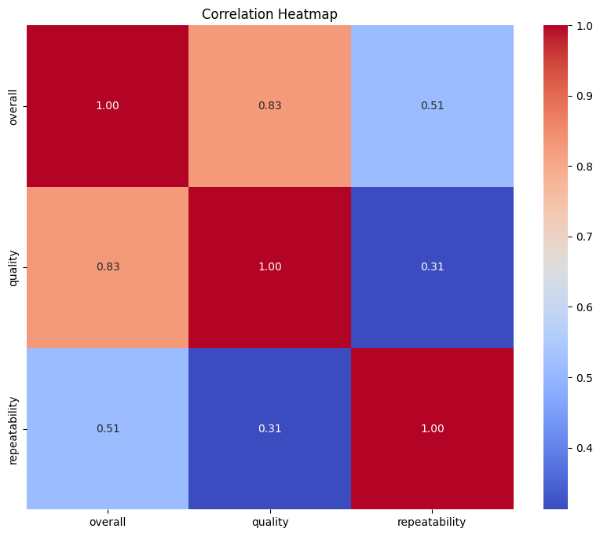
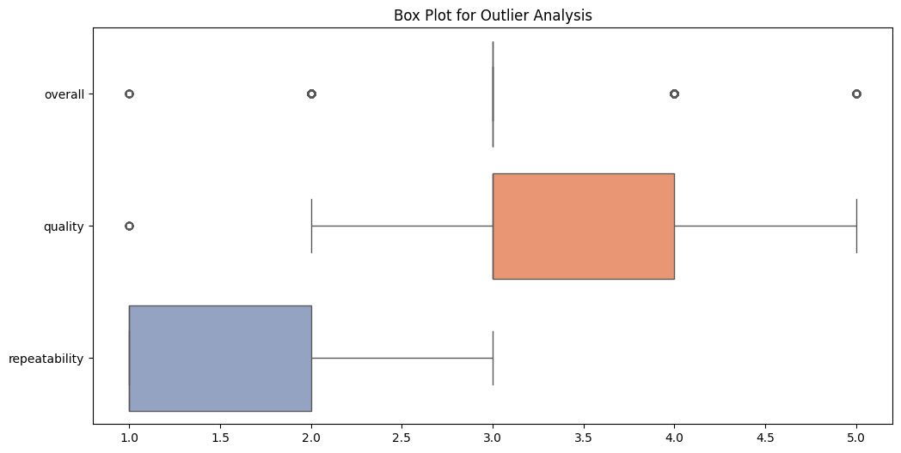

# Analysis of Media Dataset

## 1. General Description of the Dataset
The dataset consists of media-related information with a total of **2652 entries** across **8 columns**. The columns include:

- **date**: The date of the media entry (with 99 missing values).
- **language**: The language of the media which contains 11 unique values.
- **type**: The type of media (e.g., movie, series) with 8 unique categorizations.
- **title**: The title of the media with a total of 2312 unique entries.
- **by**: The creator or contributor of the media, which has 262 missing values.
- **overall**: An integer rating of the media, ranging from 1 to 5.
- **quality**: An integer assessment of the media's quality from 1 to 5.
- **repeatability**: A measurement indicating how often the media is likely to be repeated, also ranging from 1 to 3.

## 2. Descriptive Statistics of the Dataset

The descriptive statistics for the numeric columns (`overall`, `quality`, and `repeatability`) reveal:

- The mean overall rating is approximately **3.05**, indicating a generally favorable assessment.
- The quality rating has a mean of approximately **3.21**, suggesting a good quality perception of the media.
- The repeatability score with a mean of **1.49** implies that most media are not expected to be revisited frequently.

Given the nature of the ratings, the standard deviations are around **0.76** for overall ratings and **0.80** for quality, indicating moderate variability among the ratings.

### Summary Statistics Table
| Metric         | Overall     | Quality     | Repeatability |
|----------------|-------------|-------------|---------------|
| Mean           | 3.05        | 3.21        | 1.49          |
| Standard Deviation | 0.76    | 0.80        | 0.60          |
| Min            | 1           | 1           | 1             |
| 25th percentile | 3         | 3           | 1             |
| Median (50th)  | 3           | 3           | 1             |
| 75th percentile | 4         | 4           | 2             |
| Max            | 5           | 5           | 3             |

## 3. Missing Values in the Dataset
From the analysis, we found several missing values in the dataset:
- **date**: 99 missing values
- **by**: 262 missing values

It's crucial to address these missing values, especially for the 'by' column, as it may affect the analysis of media creators and their associated ratings.

## 4. Visualizing the Data
To provide a clearer understanding of the relationships between the numeric columns, we generated a **correlation heatmap**. This allows us to view potential relationships visually:

From this heatmap, we notice that:
- `overall` ratings have a strong positive correlation with `quality` ratings.
- `repeatability` shows a weaker correlation with the other two numeric variables, indicating its independent nature in the assessment.

Additionally, to analyze the distribution and potential outliers in the scoring system, we created a **box plot** for the numeric columns:

This box plot shows:
- The presence of some outliers in the `overall` and `quality` columns, which could be worth investigating further, particularly if they indicate extreme perceptions of media quality.

## 5. Potential Next Steps for Analysis
Following this initial exploration, here are some interesting avenues to pursue:
- **Handling Missing Values**: Consider strategies for imputing or removing missing data, especially in the `by` column, to enhance data integrity.
- **Outlier Analysis**: Perform detailed investigations on the outliers noted in the box plot, potentially conducting qualitative assessments to determine if they represent valid ratings.
- **Time Series Analysis**: Since there is a date variable, it would be interesting to analyze trends over time in media ratings or explore seasonal effects.
- **Comparative Analysis by Language/Type**: Delve deeper into how different media types or languages correlate with overall ratings and quality assessments.

By pursuing these next steps, we can gain richer insights from the dataset and enhance our understanding of media perceptions. 
