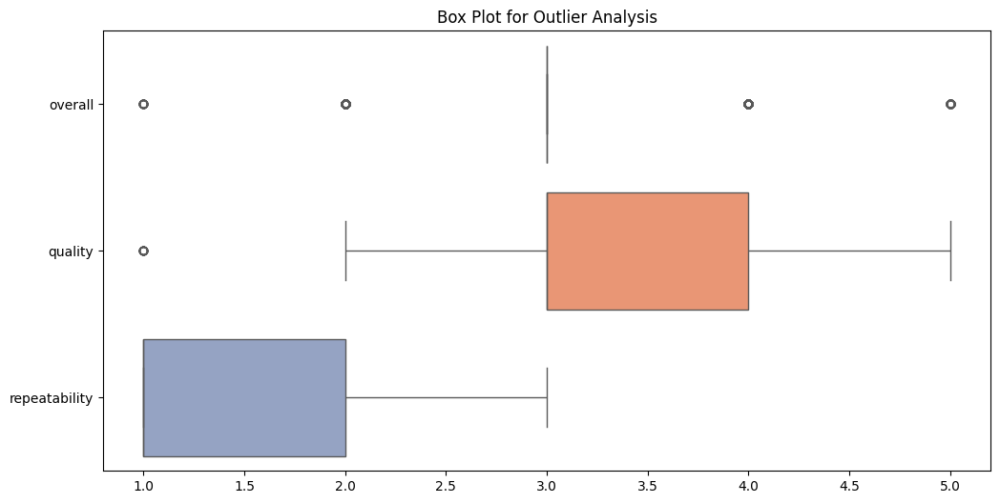

# Analysis of the Media Dataset

## General Description of the Dataset
The dataset consists of 2,652 entries with 8 columns, capturing various attributes related to media content. The columns include:

- `date`: The release date of the media.
- `language`: The language of the media.
- `type`: The type of media (e.g., movie, TV show).
- `title`: The title of the media.
- `by`: The creator or producer of the media.
- `overall`: A rating score for the media on a scale of 1 to 5.
- `quality`: A quality score, also on a scale of 1 to 5.
- `repeatability`: A score indicating how likely a viewer is to rewatch the media.

Notably, the dataset includes a mix of categorical and numerical data, making it suitable for various forms of analysis.

## Descriptive Statistics of the Dataset
The dataset provides several key statistics for the numerical columns:
- **Overall Rating**: The mean is approximately 3.05, with a standard deviation of about 0.76. Ratings range from 1 to 5.
- **Quality Rating**: The mean is about 3.21, standard deviation of 0.80, with the same range of 1 to 5.
- **Repeatability Rating**: The mean is 1.49, with a standard deviation of 0.60, and ranges from 1 to 3.

The presence of these statistics indicates a generally positive view towards the media content, especially concerning overall ratings and quality.

## Missing Values in the Dataset
Our analysis revealed some missing values:
- `date`: 99 missing entries
- `by`: 262 missing entries
- All other columns are complete with no missing values.

These gaps in the data column `by` suggest that we may not know who produced 262 entries, which may have implications for any analyses involving the creator or producer.

## Visualizations

### Correlation Heatmap
The correlation heatmap helps visualize the relationships between numerical variables. It shows how `overall`, `quality`, and `repeatability` might relate to each other:

The heatmap indicates a moderate positive correlation between `overall` and `quality`, suggesting that higher overall ratings typically correspond with higher quality ratings. The correlation between `overall` and `repeatability`, as well as between `quality` and `repeatability`, is weaker.

### Box Plot
A box plot can help identify outliers and understand the distribution of ratings:

From the box plot, we can observe the spread of `overall`, `quality`, and `repeatability` scores. The presence of outliers, specifically in `repeatability`, indicates that while most responses cluster around lower scores, there are a few media items rated much higher.

## Potential Next Steps for Analysis
1. **Handle Missing Values**: Assess the impact of the missing data in the `by` column and decide whether to fill, drop, or analyze trends at a higher level (e.g., by media type).
   
2. **Detailed Categorical Analysis**: Delve deeper into categorical columns such as `language` and `type` to uncover trends and preferences in overall ratings and quality.
   
3. **Expand Plotting**: Create additional visualizations, such as a bar chart comparing the average ratings by media type or language, to uncover further patterns.

4. **Predictive Analysis**: Consider building a predictive model to forecast the overall ratings based on other factors such as `quality`, `repeatability`, and `by`. 

This thorough examination of the media dataset offers a strong foundation for deeper analysis and insights into viewer preferences and trends. 
